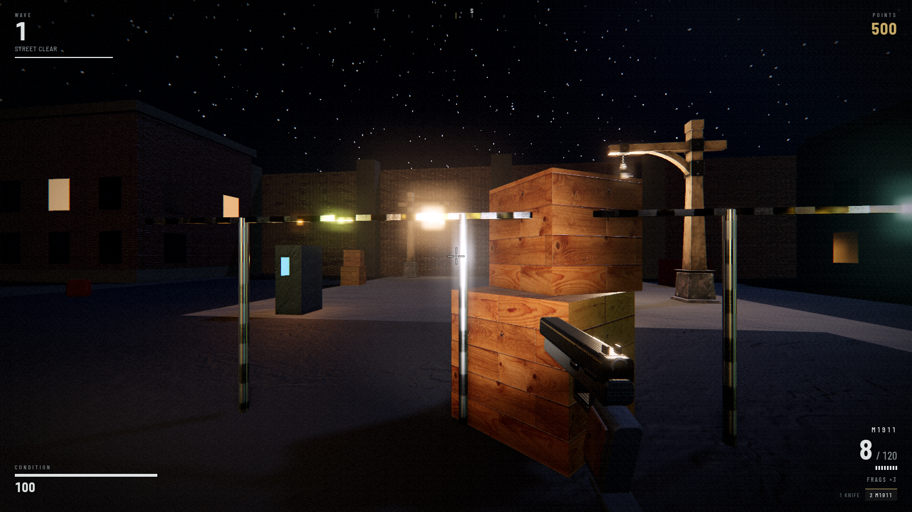
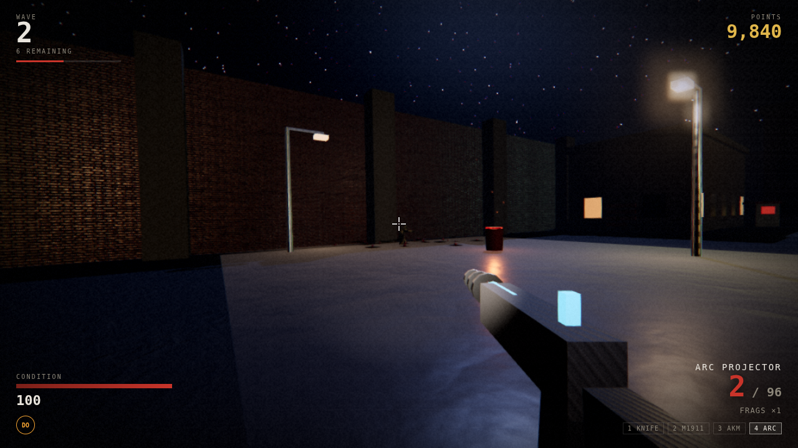

# NIGHT OF THE RISEN

A wave-survival zombie shooter that runs in the browser on WebGL2 — physically
based night rendering, a flow-field horde, and a twelve-weapon arsenal.



```bash
npm run assets     # download the asset pack from the web (once)
npm start          # serve on http://localhost:8080
```

There is no build step. The game is plain ES modules behind an import map, so
`npm start` (or any static server) is all it needs.

---

## What this is, and what it is not

The brief asked for Unreal Engine 5 "or equivalent". UE5 is not buildable here
and would not be runnable by anyone you sent it to: it is a ~120 GB editor that
needs a desktop GPU, an Epic account and a per-platform cook-and-package step.

So this is the equivalent, built to actually be played: a real-time PBR renderer
on WebGL2 with image-based lighting, cascaded-frustum shadows, screen-space
ambient occlusion, bloom and a filmic grade — running in any browser, from a
link, at 60 fps. Every technique below is the same technique a UE5 project would
use; the budget is just smaller and the delivery is a URL.

## Performance

The target is **60 fps**, with a hard floor of 30 held by an adaptive scaler.

| | |
|---|---|
| Static level | ~12 draw calls (all geometry merged per material) |
| Downloaded props | 1 instanced draw call per material, whatever the count |
| Effects layer | ~6 draw calls regardless of activity |
| Zombie eyes | 1 draw call for the entire horde |
| Steady-state allocation | zero — everything hot is pooled |
| Frame budget defence | resolution scaling, never simulation rate |

Specific decisions that buy the frame time:

- **Flow-field navigation.** One breadth-first flood from the player over a
  coarse walkability grid, five times a second. Each zombie then reads a single
  vector out of the field, so pathing is O(1) per agent instead of O(path).
  Sixty zombies navigate real corners and doorways for the cost of one search.
- **Merged static geometry.** Every box, window and prop in the level is baked
  into one mesh per material at build time.
- **Animation LOD.** Skinning is the most expensive thing in the frame, so
  distant zombies evaluate their skeleton every second or fourth frame and stop
  contributing to the shadow map past a distance set by the quality tier.
- **Analytic collision and hit detection.** No BVH and no mesh raycasts —
  bullets test against yaw-aligned boxes and per-zombie capsule + head sphere,
  which is a handful of float operations and keeps headshots accurate mid-animation.
- **A pooled light budget.** The level has ~100 emissive fixtures but only ever
  pays for the nearest few, ranked by importance as well as distance. Everything
  else is covered by baked additive ground pools in a single draw call.
- **Adaptive resolution.** A rolling frame-time average nudges render scale
  between 0.55× and 1× with hysteresis. The simulation rate never changes, so
  the game feels identical whether it is holding 30 or 144.

Quality tiers (`Low` / `Medium` / `High` / `Ultra`) are picked from a GPU probe
on first run and are switchable in-game; they control shadow resolution, AO,
bloom, draw distance, particle budget and the live-zombie cap (22 → 60).

## The game

**Precinct 13, sealed.** A city block with a plaza to hold, four street spokes,
and an unbroken ring road — because when the plaza fills up, the only answer is
to start a lap and let the horde string out behind you.

Waves are built from a **points budget**, not a body count, so difficulty scales
through composition as well as numbers:

| Wave | What arrives |
|---|---|
| 1 | Walkers |
| 3 | Runners — fast, and they flank |
| 5 | **Abomination.** The sky turns red. Every fifth wave. |
| 5 | Crawlers — small target, quick |
| 6 | Brutes — charge in a straight line, shrug off stagger |
| 8 | Spitters — ranged acid, punishes standing still |
| 10 | Screamers — turn the whole street into runners |

Points come from **damage as well as kills**, so nothing you shoot is wasted,
and chipping a brute still pays for your next weapon. Headshots do far more
damage and pay 50% more.

Spend points on:

- **Wall-buys** — one weapon mounted on each corner block's plaza-facing wall.
- **The ammo crate** in the plaza — tops up everything you carry, plus grenades.
- **Four perks** — Juggernog (double health), Stamin-Up (speed), Double Tap
  (fire rate), Speed Cola (reload).
- **The mystery box** — a weapon at random, after a spin that is the most
  exciting three seconds in the game. It moves on after a few uses, so spend
  while it is close.
- **The Arc Furnace**, from wave 8 — doubles the held weapon's damage and adds
  half again to its reserve. It is what keeps a wave-3 rifle relevant at wave 25.

Six power-ups drop from kills: Insta-Kill, Double Points, Max Ammo, Nuke, Deep
Freeze and Carnage.

### The arsenal



Twelve weapons, each built to solve a problem the others do not.

| | Weapon | Why you would carry it |
|---|---|---|
| 🔪 | Trench Knife | Free, silent, enough for wave one |
| 🔫 | M1911 | Insurance. Infinite reserve at the crate |
| 🔫 | .44 Peacekeeper | Punches through two bodies and staggers the third |
| 🔫 | MP-9 Hornet | Shreds runners inside twenty metres |
| 🔫 | AKM-74 | The all-rounder |
| 💥 | SPAS-12 Breaker | Owns a doorway. Ten pellets, all of them can crit |
| 🎯 | Longbow .338 | Pierces five. Line the street up and pull once |
| 🌀 | M-901 Reaper | Spins up, then does not stop |
| 🔥 | Cinder Mk II | Sets the pack alight; damage keeps ticking |
| ⚡ | Arc Projector | Chains to five targets — the answer to a pile-up |
| 💣 | M79 Thumper | One shell, one crowd |
| ☄️ | Ferro Lance | Charge, release, erase a lane |

Weapons are **procedural** — assembled from primitives and merged per material,
three or four draw calls each — and they live in the main scene parented to the
camera, so they take the world's light, the muzzle flash, the bloom and the
grade. A gun rendered in its own pass always looks pasted on. The trade is wall
clipping, handled by pulling the weapon back when something solid is close.

### The horde

The zombies are a Mixamo-rigged skinned mesh playing a walk/run clip with a
**procedural pose layer applied on top of the bones every frame**: a forward
hunch across the spine, a lateral lurch on a per-zombie phase, a lolling head
and arms reaching forward. That layer is what turns a marching soldier into
something that shambles, and it costs a few quaternion multiplies each.

Their skin is a shader pass over the source texture — desaturated, pushed toward
a per-archetype tint, mottled with necrosis and dried blood from a noise lookup,
so no two read the same. They flash white when hit and **dissolve** along a
noise threshold with a hot rim when they die, rather than blinking out.

Each one has a pair of additive eye quads billboarded from the head bone, drawn
for the entire horde in one instanced call. In a level this dark, a pair of
points coming at you out of an alley does more work than any amount of texture
detail.

## Controls

| | |
|---|---|
| `W` `A` `S` `D` | Move |
| `Shift` / `Ctrl` / `Space` | Sprint / Crouch / Jump |
| Mouse · `LMB` · `RMB` | Aim · Fire · Aim down sights |
| `R` · `G` · `F` | Reload · Grenade · Flashlight |
| `E` | Buy / interact |
| `1`–`4`, wheel, `Q` | Switch weapon, last weapon |
| `Esc` · `F3` | Pause · Performance overlay |

On a touchscreen the game switches to on-screen controls automatically — see
[Touch controls](#touch-controls).

## Assets

Every runtime asset is **downloaded from the web** by `tools/fetch-assets.mjs`,
which reads `tools/assets.manifest.json` — 29 files, ~19 MB, each entry
recording its source, licence and what it is used for. Sources are the three.js
example asset pool (MIT), Poly Haven HDRIs (CC0) and the Khronos glTF Sample
Assets (CC0 / CC-BY 4.0).

Some assets are CC-BY, which obliges us to credit them where players can see
it, so the downloader also generates `assets/credits.json` from the manifest and
the game renders it on a **Credits** screen. Generating it means the credits
cannot drift as assets are added or swapped — and the touch test asserts the
CC-BY holders actually appear on screen.

### Models

The props are real glTF assets, not boxes:

| | |
|---|---|
| **Street lamps** | Khronos "old wooden street light" — 5,394 tris, one material across its three meshes with base colour, normal, metallic-roughness **and emissive** maps, so the lantern glass genuinely glows. CC0. |
| **Smashed windows** | Ground-floor windows on the plaza-facing walls, with alpha-masked shatter holes. CC-BY, Wayfair. |
| **Traffic cones** | Clustered at the barricades, some knocked over. CC-BY, hinndia. |

Every one is drawn with `InstancedMesh`: fourteen lamp posts are **one draw
call**, not fourteen.

Getting them to fit took more than downloading them. `PropLibrary.prepare()`
pulls out only the nodes that are the object (the traffic cone ships inside a
demo scene with a 19.7 m ground plane, a camera and a light), bakes each mesh's
transform into its geometry, normalises the result to a real-world height with
its base on the ground, and hands the materials to a per-asset tweak — because
these are authored for daylight product viewers. The cone's retroreflective
orange read as a glowing plastic toy under moonlight until its albedo was
knocked down; the window frame arrived showroom white and had to be made
filthy; the window glass had its `KHR_materials_transmission` stripped, since
transmission needs its own render pass and at night the difference is invisible.

The lamp's light is placed at the lantern's **own bulb**, read out of the model
as a marker node, rather than guessed from an offset.

**What was rejected, and why.** Twelve candidates were evaluated by rendering
them (`tools/modelpreview.html`), which is the only way to catch what a triangle
count will not tell you:

- **PotOfCoals** — would have been a perfect brazier, but it carries a large
  glTF logo across its side. That is Khronos trademark material, not something
  to ship in a game.
- **CarConcept** (213k tris), **CommercialRefrigerator** (208k), **ScatteringSkull**
  (188k) — absurd cost for background props, and all three use expensive
  transmission/dispersion extensions.
- **BoomBox**, **DamagedHelmet**, **AnisotropyBarnLamp** — pristine
  product-visualisation pieces. Art-direction coherence beats polygon count; a
  spotless designer lamp in a ruined precinct looks *worse*, not more real.
- **Sponza** — 262k tris of palace interior, the wrong arena for a city block.
  Its material library was tested for reuse, but only one of its 25 textures
  actually tiles, so it would have seamed across a 90 m street.

Downloaded assets are combined and extended at load time rather than used raw:

- Height maps that shipped without normal maps are **Sobel-filtered into real
  tangent-space normal maps** on load, so brick and wood catch the flashlight
  with actual relief.
- Large tiled surfaces get a **world-space detail breakup** injected into their
  shader — one extra texture fetch at a different scale, modulating albedo and
  roughness, which destroys the visible repetition of a 1k texture stretched
  across a 90 m street.
- The night sky, the light-pool falloff and every sound effect are generated at
  runtime.

**All audio is synthesised** with the Web Audio API — layered gunshots whose
body, crack and tail come from the weapon definition, formant-filtered zombie
vocals that differ per archetype, wet impacts, ricochet whines and an ambient
wind bed that brightens as the horde closes in. Nothing is sampled, so every
shot and every growl is slightly different.

---

## Android

The game ships as an Android app: a single-activity WebView shell that serves
the bundled game from inside the APK. Everything is offline — no network
permission, nothing fetched at runtime.

### Getting an APK

**From CI (nothing to install).** Push the branch and the
`Build Android APK` workflow assembles it, then attaches
`night-of-the-risen-debug-apk` to the run. Download, copy to the phone, install.
It is signed with the standard debug key, so it installs on any device with
"install unknown apps" allowed for your file manager.

**Locally**, with the Android SDK present (Android Studio, or just
command-line tools):

```bash
npm run assets                       # once — downloads the asset pack
cd android && ./gradlew assembleDebug
# → android/app/build/outputs/apk/debug/app-debug.apk
adb install -r android/app/build/outputs/apk/debug/app-debug.apk
```

For a store-ready build, put a keystore in `~/.gradle/gradle.properties`:

```properties
NOTR_STORE_FILE=/absolute/path/to/keystore.jks
NOTR_STORE_PASSWORD=…
NOTR_KEY_ALIAS=…
NOTR_KEY_PASSWORD=…
```

…then `./gradlew assembleRelease`. Without those properties the release task
still runs and produces an unsigned APK you can sign yourself with `apksigner`.

### Is it actually built?

Yes — by CI, on every push. The most recent run produced:

| | |
|---|---|
| `app-debug.apk` | 21.7 MB · 375 entries · installable as-is |
| `app-release-unsigned.apk` | 22 MB · passes `lintVital` |
| Bundle check | **29/29 manifest assets present**, 13/13 engine modules, 329 bundled game files |

The bundle check is not a formality. The failure that matters for a WebView
game is an APK that builds, installs and launches to a black screen because one
asset never made it in — a green build says nothing about that. So
`tools/verify-apk.mjs` opens the APK and looks for every entry in the asset
manifest by name, plus the engine modules and the Android bits, and fails a
bundle that is implausibly small. It was checked in both directions against
synthetic fixtures before being trusted.

> **Why the APK is not built in the authoring sandbox.** The Android Gradle
> Plugin is published only on Google's Maven repository, and `dl.google.com`
> and `maven.google.com` are both blocked by egress policy there, as is the SDK
> download. Everything not needing them was verified locally — XML validated,
> Java syntax checked, Gradle scripts parsed to the point of plugin resolution —
> and the compile itself happens on CI, which has the SDK and the network.

### What the shell does

| | |
|---|---|
| Origin | Served through `WebViewAssetLoader` on `https://appassets.androidplatform.net`, **not** `file://` — a `file://` page has an opaque origin and ES modules, import maps and `fetch` are all blocked there |
| Display | Sticky immersive, `sensorLandscape`, draws into the display cutout |
| Lifecycle | Back pauses a run (and only leaves from a menu); `onPause` pauses the game and stops the timers so it does not drain battery in the background |
| Storage | DOM storage on, so settings and your best run survive a restart |
| Gestures | Zoom, long-press selection, overscroll and text auto-sizing all disabled — the page owns every touch |
| Assets | `glb`/`hdr`/`jpg`/`png`/`ogg` are stored uncompressed in the APK; they are already compressed, so re-packing them only costs load time on device |

The web build is the single source of truth: a Gradle `Sync` task mirrors
`index.html`, `src/`, `vendor/` and `assets/` into the APK at build time, so
there is no second copy to keep up to date.

**Requirements:** Android 8.0 (API 26) or newer, and a System WebView recent
enough for WebGL2 and import maps. If either is missing the game says so
explicitly on the loading screen rather than showing a black rectangle.

### Touch controls

| | |
|---|---|
| Left half | Floating movement stick — the base appears wherever your thumb lands, so you never have to find it without looking |
| Left half, held forward | Auto-sprint after a moment; no extra button |
| Right half | Drag anywhere to look |
| FIRE | Hold to fire — and **drag off it to keep firing while you turn**, which is the only way to shoot something that is moving |
| AIM / CROUCH | Toggles, so they cost a tap rather than a held thumb |
| RELOAD · FRAG · JUMP · LIGHT | Tap |
| Weapon slots | Down the right edge; the active one is highlighted |
| BUY | Appears in the centre only when you are standing at a station, labelled with the action and the price |

Two assists make thumb-aiming viable, both switchable in Settings:

- **Aim assist** pulls the view toward a target already near the crosshair. Its
  strength falls to zero at the edge of the cone and it only acts while you are
  actually looking or firing — park your thumb and it stops.
- **Auto-fire** shoots when the crosshair is genuinely on a zombie. It is an
  exact ray test that has to reach the target without passing through geometry
  first, so it never fires at a wall, and it is off for the knife and the
  grenade launcher.

### Mobile performance

Phone hardware is limited by memory bandwidth and heat more than raw shading,
so `mobilePreset()` clamps what moves the most pixels: device pixel ratio to
1.0 (a 3× screen is nine times the fill for no visible gain at this art
density), shadow maps to 1k, draw distance to 125 m, live zombies to 26, and
ambient occlusion off entirely. The adaptive scaler then defends the frame rate
on top of that, so a weak device degrades resolution rather than dropping
frames.

---

## Project layout

```
android/     Gradle project: WebView shell, manifest, resources, icon
src/
  core/      util, quality tiers + adaptive scaler, input, touch input,
             asset loader, audio synth
  render/    renderer + post chain, night sky, final grade, particles/decals/gore
  world/     PBR material library, arena generator, collision + flow-field nav
  entities/  player controller, zombie manager, archetype table
  weapons/   arsenal data, procedural viewmodels, combat resolution
  game/      wave director + power-ups, economy/perks/mystery box
  ui/        HUD
tools/       asset manifest + downloader, headless + touch test harnesses
.github/     CI that assembles the APK and runs the browser checks
vendor/      three.js r180 (build + addons), vendored so there is no install step
```

## Testing

Two layers, both runnable from a clean checkout:

```bash
npm test        # 22 logic tests — no browser, no GPU, runs in under a second
npm run smoke   # boot, load assets, build the level, render, report timings
npm run touch   # 18 touch-control checks in a landscape phone viewport
node tools/smoke.mjs --page index.html --bot --run 60   # play it with a bot
```

`npm run touch` drives the game with **real touch events through the DevTools
Protocol** — not synthesised DOM events — and asserts that each control moves
the thing it is supposed to: the stick walks the player, the right half turns
the camera, FIRE fires, dragging off FIRE keeps firing *and* steers, and two
thumbs work at once (the case a single-pointer implementation quietly breaks).

`npm test` covers the pure systems where a regression is easy to introduce and
hard to notice by playing: collision ejection and ray/OBB intersection, whether
the flow field actually routes around a wall rather than through it, damage
falloff, the health and wave curves staying inside a killable band, and the
pooling primitives.

`--bot` runs a scripted player that walks, aims, fires, reloads, throws grenades
and buys from stations, so a test run exercises spawning, pathing, hit
detection, gore, the economy and wave transitions with nobody at the mouse. Any
console error, unhandled rejection or page error fails the run.

Useful flags: `--viewport 640x360` (software rendering is slow at full size),
`--shot out.png --views 4`, and `--params "give=rifle,tesla&wave=5&points=9000"`
to drop the harness straight into a boss wave with an arsenal.

## Licence

Game code is MIT. Vendored three.js is MIT (`vendor/three/LICENSE`). Downloaded
assets keep their own licences, recorded per entry in
`tools/assets.manifest.json`.
